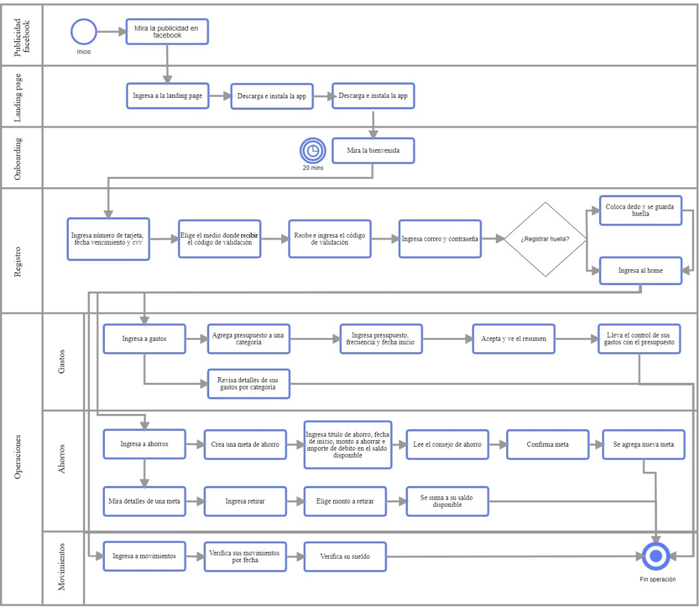

#  Rediseño de la Fintech: "Tus Finanzas"

## I.- Antecedentes

## II.- Planteamiento de objetivos

## III.- Implementación

Para realizar este proyecto hemos escogido y utilizado las siguientes actividades:

|Actividad|Descripción|Puntos|
|:----|:---|:---:|
|Entendimiento del problema, la industria y el contexto|Entender el contexto del negocio y lo que existe hoy en día respecto de la industria del proyecto.| 15 |
|Entrevistas con cliente| Realización de entrevistas con el cliente (dueño del reto) y establecimiento de sus metas y objetivos. | 25 |
|Benchmark| Revisión de features de la competencia y referencias análogas. | 20 |
|Entrevistas con usuarios| Entrevistas en profundidad con al menos 5 usuarios. | 60 | 
|Flujo / árbol de contenidos| Documento que estructura contenidos y su navegación | 15 |
|Testeo de soluciones actuales de la competencia|Sesiones de testing de productos actuales de la competencia para ver qué atributos valoran los usuarios. Al menos 5 usuarios. | 50 |
|Testeos de prototipos| Sesiones de testing de la solución propuesta (baja, media y alta fidelidad) con al menos 5 usuarios por sesión. | 60 |
|Sketching y wireframing| Elaboración de prototipos de baja y mediana fidelidad. | 30 |
|Prototipado de alta fidelidad| Elaboración de prototipo en base a las pantallas diseñadas. | 80 |
|Total|  | 340 |

## III.- Desarrollo del proyecto

## 1. DESCUBRIMIENTO E INVESTIGACIÓN

### Contexto en el Perú

### Entrevista con el cliente

### Testing del prototipo del cliente

- [Videos del testing del prototipo del cliente](https://drive.google.com/drive/folders/1ifuyjWy3eJju9gqBIsDcExofHeUu-pyX)

- [Reporte de Maze](https://maze.design/r/7bnqac4vjw74m6h6)

### Entrevistas con posibles usuarios

- [Videos y audios de las entrevistas](https://drive.google.com/drive/folders/1WW0W1aluir30s_trWUUykadW5I5RURiQ)

### Análisis de la data

## 2. SÍNTESIS Y DEFINICIÓN
### Affinity map

### User persona

### Customer journey map

### Problem statements

## 3. IDEACIÓN

### Benchmark de funcionalidades

### User flow

## 4 y 5. PROTOTIPADO Y TESTING

###  Prototipo de baja fidelidad

###  Prototipo de alta fidelidad

###  Feedback (banco Ripley)

###  Testing del prototipo de alta fidelidad

###  Segundo prototipo de alta fidelidad

## IV.- RECOMENDACIONES

## V.- ENLACES

## Prototipo navegable
[Link a prototipo navegable](https://projects.invisionapp.com/share/RFSJ23O683C#/screens/368942054)

## Link de Figma
[Link a prototipo navegable](https://www.figma.com/file/IRiu59RvKAVfuwHIkfyEKM/App-financiera?node-id=2610%3A0)

## Link de Zeplin
[Link a Zeplin](https://zpl.io/bz6RnBl)

## Proyecto en Drive
[Link a documentación en Google Drive](https://drive.google.com/drive/folders/1-dxbjFv4YzBd6SrMB8hsboVAw0xcpNlc)

